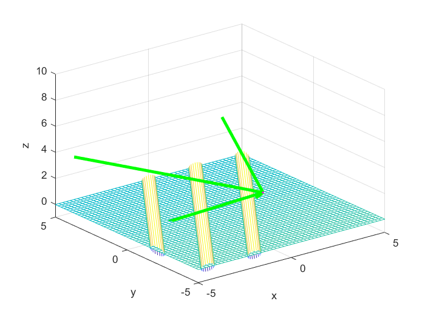

# Code for 3D point cloud processing for UGV guidance

A Matlab and Python project for simulating a depth camera within a scene, and performing crop row angle prediction using Hough transform, RANSAC and NVIDIA's DriveNet CNN model. This project is part of a thesis submitted as a requirement for the degree of Bachelor of Engineering in Mechatronic Engineering. 

## Installation and usage
Download the program and run by executing `simulator/main.m` in Matlab for Hough transform and RANSAC predictions. Run `cnn/run.py` in Python 3 to start training, and `cnn/predict.py` to start predicting.

## simulator
* **`SceneObject.m`** depicts objects placed in the main scene. They all have a location and rotation, and a function `intersection` for the locations it intersects a `Ray`.
    * Two scene objects have been provided, `Cylinder` and `Plane`.
* **`Camera.m`** contains an object placed in the main scene and is assigned camera properties that define its view. Points cast from the camera after `render` is called is stored in `camera.Points`. 
* **`performHough.m`** and **`performRANSAC.m`** performs processing on the extracted point cloud.

## cnn
* The DriveNet CNN is programmed in Python and uses TensorFlow and Keras, with visualisations using Matplotlib. 
